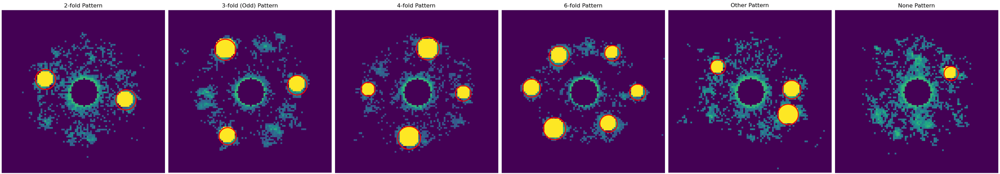
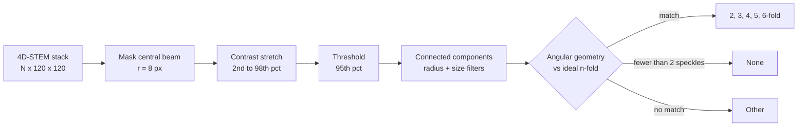
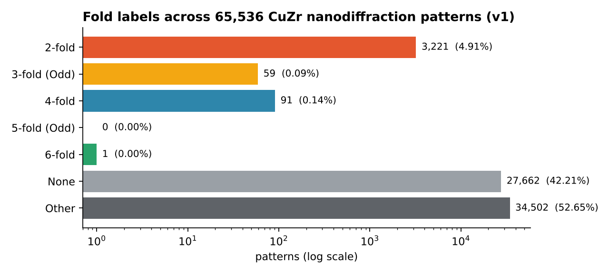
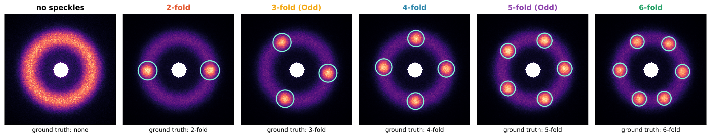
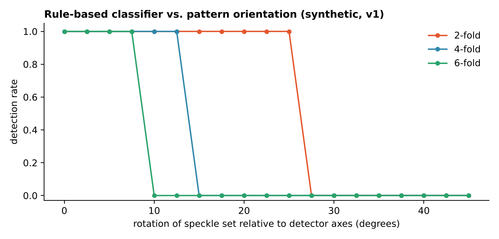

# Finding Order in Disorder

**Automated detection of local fold symmetry in 4D-STEM nanodiffraction patterns of CuZr metallic glass**

[](https://github.com/hamdanashfaq63/DA401/actions/workflows/ci.yml)


Hamdan Ashfaq · Senior capstone (DA 401), Denison University, Spring 2026 · Data from the Hwang Lab, The Ohio State University



Metallic glasses have no long-range crystal order, but they do have *medium-range order*: small clusters of atoms arranged with local 2-, 3-, 4-, 5- or 6-fold symmetry. In 4D-STEM, a focused electron probe is rastered across the sample and a diffraction pattern is recorded at every position. When the probe passes through an ordered cluster, bright speckles appear on the amorphous ring at angles that reveal the cluster's symmetry.

A single scan produces tens of thousands of these patterns, far too many to inspect by eye. This project builds `foldsym`, a pipeline that finds the speckles in each pattern and classifies its fold symmetry, then uses it to map symmetry across **65,536 patterns** from a CuZr-based metallic glass.

## Highlights

* **End to end pipeline**: beam masking, contrast normalization, connected-component speckle detection, and a geometric classifier that checks angular spacing and opposite-pair structure for each fold order.
* **Results on real data**: 3,372 patterns (5.1%) receive a definite fold label, dominated by 2-fold order. The remaining 94.9% are the target for a learned, self-supervised representation.
* **Characterized failure modes**: on synthetic patterns with known ground truth, the rule-based classifier is accurate when speckles are aligned with the detector but fails beyond a fixed rotation (9° for 6-fold, 13.5° for 4-fold). This is the main argument for the learned approach.
* **Reproducible without the private data**: a synthetic pattern generator, a CLI, 29 unit tests and CI. The packaged code reproduces the original research notebook label for label.

## How it works



1. **Speckle detection** ([`detect.py`](src/foldsym/detect.py)). The unscattered beam is masked, intensities are stretched between the 2nd and 98th percentile, and pixels above a high percentile are grouped into connected regions. Regions are kept if their equivalent radius is plausible for a speckle and within 0.5x to 1.5x of the median speckle size in that pattern.
2. **Symmetry classification** ([`classify.py`](src/foldsym/classify.py)). Speckle azimuths are compared with the ideal angles for each fold order. A fold is accepted when every speckle lies within a tolerance of an ideal angle and, for even folds, speckles form 180° pairs.
3. **Two configurations** ([`config.py`](src/foldsym/config.py)). `v1` produced the reported results. `v2` is a later tuned variant (tighter radius window, lower threshold, wider 4- and 6-fold tolerance). Both are kept so the results stay reproducible.

| | v1 (reported) | v2 (tuned) |
|---|---|---|
| Intensity threshold | 95th percentile | 92nd percentile |
| Speckle radius | 4 to 15 px | 6 to 10 px |
| Speckle count rule | exactly n | at least n, max 8 considered |
| Angular tolerance | 15% of spacing | 15%, or 25% for 4- and 6-fold |

## Results



| Label | v1 count | v1 share | v2 count | v2 share |
|---|---:|---:|---:|---:|
| 2-fold | 3,221 | 4.91% | 2,004 | 3.06% |
| 3-fold | 59 | 0.09% | 29 | 0.04% |
| 4-fold | 91 | 0.14% | 127 | 0.19% |
| 5-fold | 0 | 0.00% | 0 | 0.00% |
| 6-fold | 1 | <0.01% | 3 | <0.01% |
| None | 27,662 | 42.21% | 47,661 | 72.73% |
| Other | 34,502 | 52.65% | 15,712 | 23.97% |
| **Definite fold** | **3,372** | **5.15%** | **2,163** | **3.30%** |

*None* includes every pattern where fewer than two speckles were detected. The original notebook dropped patterns with zero speckles from its printed counts, so its totals are lower; here every pattern is counted.

What the numbers say:

* **2-fold order dominates.** It is by far the most common definite symmetry under both configurations, and 5-fold order is never detected.
* **Most patterns are ambiguous.** Over half of the patterns under v1 contain speckles that fit no ideal geometry. These are the patterns a rule cannot resolve.
* **Labels do not separate in raw pixel space.** A t-SNE embedding of the raw patterns, colored by label, shows no structure ([notebook](notebooks/01_capstone_exploration.ipynb), step 6). Whatever distinguishes these patterns is not captured by pixel distances.

## Validation and limitations

Because the experimental data has no ground truth, the pipeline is validated on synthetic patterns ([`synthetic.py`](src/foldsym/synthetic.py)) that mimic the central beam, the amorphous ring, noise, and n speckles at known angles.



On axis-aligned synthetic patterns, v1 recovers every fold order from 2 to 6. Three limitations stand out:

**1. Orientation sensitivity.** The ideal angles start at 0°, so the rule assumes speckles line up with the detector axes. Real clusters can sit at any rotation, and detection drops to zero once the offset exceeds the tolerance.



**2. Threshold coupling in v2.** v2 thresholds at the 92nd percentile. With only two speckles, that threshold also captures the amorphous ring, so the speckles merge into it and the pattern is lost. On synthetic data v2 detects 2% of 2-fold patterns, which is consistent with it finding fewer 2-fold patterns than v1 on the real data.

**3. Noise speckles in v1.** v1's looser size filter lets noise blobs on the ring through, so some speckle-free patterns are labelled *Other* rather than *None*.

These are inherent to hand-tuned rules rather than bugs, and they motivate the next stage.

## Next step: self-supervised representation learning

The second phase replaces hand-tuned rules with a learned representation: **SimSiam** self-supervised learning with a ResNet-18 backbone, followed by K-means clustering of the embeddings. The clusters will be compared against this rule-based baseline, with particular attention to the None and Other patterns the rules cannot resolve. Training runs on GPU nodes at the Ohio Supercomputer Center.

## Quickstart

```bash
git clone https://github.com/hamdanashfaq63/DA401.git
cd DA401
pip install -e ".[dev]"

foldsym demo                                   # synthetic data, prints accuracy
foldsym run data/stack.tif --config v1 --out results/v1
pytest -q
```

`foldsym run` accepts any `(N, H, W)` stack as TIFF or `.npy` and writes `labels.csv`, `summary.json` and `distribution.png`.

From Python:

```python
from foldsym import V1, process_image
from foldsym.synthetic import make_pattern

result = process_image(make_pattern(n_fold=6, rng=0), V1)
print(result.label, result.speckles.shape)   # 6-fold (6, 3)
```

To regenerate the figures in this README that do not need the private data, run `python scripts/make_figures.py`.

## Repository layout

```
DA401/
├── src/foldsym/
│   ├── config.py        v1 and v2 pipeline settings
│   ├── detect.py        speckle detection
│   ├── classify.py      fold classification
│   ├── pipeline.py      per-pattern and whole-stack processing
│   ├── synthetic.py     synthetic patterns with known symmetry
│   ├── viz.py           plotting helpers
│   └── cli.py           foldsym command
├── notebooks/
│   ├── 00_quickstart.ipynb             runs on synthetic data
│   └── 01_capstone_exploration.ipynb   original research log, annotated
├── tests/               unit and end to end tests
├── scripts/make_figures.py
├── assets/              README figures
└── data/                (not tracked; see data/README.md)
```

## Data

The experimental dataset is 65,536 nanodiffraction patterns (120 x 120 px) from a CuZr-based metallic glass, collected by the Hwang Lab at The Ohio State University and used with permission. It is not redistributed. See [`data/README.md`](data/README.md).

## Acknowledgements

Advised by Professor Mason Shero (Denison University). Data and scientific guidance from Professor Jinwoo Hwang (The Ohio State University).

## References

* Im et al. (2021). Medium range ordering in Zr-Cu-Co-Al metallic glasses. *Physical Review Materials* 5(11), 115601.
* Zhu et al. (2024). Structural degeneracy and formation of crystallographic domains in epitaxial LaFeO3 films revealed by machine-learning assisted 4D-STEM. *Scientific Reports* 14, 4198.
* Chen and He (2021). Exploring simple Siamese representation learning. *CVPR 2021*.
* Ophus (2019). Four-dimensional scanning transmission electron microscopy (4D-STEM): from scanning nanodiffraction to ptychography and beyond. *Microscopy and Microanalysis* 25(3), 563-582.

## License

Code is released under the [MIT License](LICENSE).
